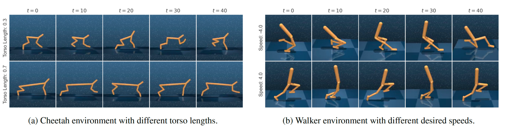

# Contextual Control Suite

This package implements a series of Contextual MDPs based on [DeepMind Control Suite](https://github.com/deepmind/dm_control). The original environments are modified such that the context of the MDP specifies the dynamics and rewards settings.



If you use our code, please cite our [AAAI 2023 paper](https://arxiv.org/abs/2211.15457): 

```bib
@article{rezaei2022hypernetworks,
  title={Hypernetworks for Zero-shot Transfer in Reinforcement Learning},
  author={Rezaei-Shoshtari, Sahand and Morissette, Charlotte and Hogan, Francois Robert and Dudek, Gregory and Meger, David},
  journal={arXiv preprint arXiv:2211.15457},
  year={2022}
}
```

## Setup
* Install the following libraries needed for Mujoco and DeepMind Control Suite:
```commandline
sudo apt update
sudo apt install libosmesa6-dev libgl1-mesa-glx libglfw3
```
* We recommend using a conda virtual environment to run the code.
Create the virtual environment:
```commandline
conda create -n contextual_env python=3.9
conda activate contextual_env
pip install --upgrade pip
```
* Install [Mujoco](https://github.com/deepmind/mujoco) and [DeepMind Control Suite](https://github.com/deepmind/dm_control)
following the official instructions.
* Clone this package and install its dependencies:
```commandline
pip install -r requirements.txt
```
* Finally install the `contextual_control_suite` package with `pip`: 
```commandline
pip install -e .
```

## Instructions
* A demo script showing how to use the contexts is available [here](demo.py).
* All environments are implemented based on the original DeepMind Control environments. 
Contexts of the MDP, either rewards or dynamics, are passed through a dictionary to the environment:

```python
from contextual_control_suite import suite

# Reward parameters
reward_kwargs = {
    'ALL': {
        'sigmoid': 'linear',
        'margin': 10,
    },
}

# Dynamics parameters
dynamics_kwargs = {
    'length': 0.5
}

task_kwargs = {
    'reward_kwargs': reward_kwargs,
    'dynamics_kwargs': dynamics_kwargs
}

# Create the environment with the custom task parameters
env = suite.load('cheetah', 'run', task_kwargs=task_kwargs)
```
* **Note:** `reward_kwargs` and `dynamics_kwargs` are environment dependant, please see
each environment for its specific parameters.
* To train RL agents on a wide range of environments sampled from `contexual_dm_control`, 
see [hyperzero](https://github.com/SAIC-MONTREAL/hyperzero). 
